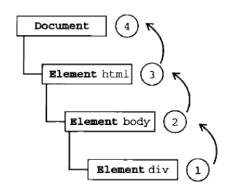
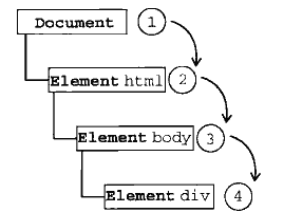

Js中 dom0级事件与dom2级事件
=========================

## 0级DOM

分为2个：
*	一是在标签内写onclick事件
*	二是在JS写onclick=function(){}函数

```html

<input id="button" type="button" value="Press Me" onclick="alert('thanks');">

```

```js

document.getElementById('myButton').onclick = function(){
	alert('thanks');
}

```

**注意**：对于上面的button，其实通过了两种方式定义它的事件处理，意识在input标签里，二是在js中处理。但是，在同时运行上面的两段代码的时候，会发现之弹出一个“thanks”。也就是说，在dom0级事件处理中，后面定义的事件处理会覆盖前面的。

## 1级DOM

DOM级别1于1998年10月1日成为W3C推荐标准。1级DOM标准中并没有定义事件相关的内容，所以没有所谓的1级DOM事件模型。在2级DOM中除了定义了一些DOM相关的操作之外还定义了一个事件模型，这个标准下的事件模型就是我们所说的2级DOM事件模型。

## 2级DOM

只有一个：空间听方法，有两个方法用来添加和移除事件处理程序：addEventListener()和removeEventListener()。

他们都有三个参数：

*	第一个参数：事件名（如click）；
*	第二个参数：事件处理程序函数；
*	第三个参数：如果是true则表示在捕获阶段调用，为false表示在冒泡阶段调用。
*	addEventListener()：可以为元素添加多个事件处理程序，触发时会按照添加顺序依次调用。
*	removeEventListener()：不能移除匿名添加的函数。

**注意**：只有2级DOM包含3个事件阶段：事件捕获阶段、捕获目标阶段和事件冒泡阶段

### 事件冒泡（常用）

IE中采用的事件流是事件冒泡，先从具体的接受元素，然后逐步向上传播到不具体的元素



### 事件捕获（少用）

Netscapte采用事件捕获，先由不具体的元素接收事件，到具体的节点最后才接收事件。



### DOM事件流


下面来一个dom2级的事件处理：

```js

document.getElementById('btn').addEventListener('click', function(){
	console.log('I am processed by dom2!');
});

document.getElementById('btn').addEventListener('click', function(){
	console.log('I am processed by dom2 again!!');
});

// 触发结果:
// I am processed by dom2!
// I am processed by dom2 again!!

```

从上面代码可以发现，dom2级事件处理中，对一个按钮的点击事件没有发生覆盖，所以dom0和dom2级事件处理，在形式上和功能上都是有差异的。

目前不仅仅有dom2级，dom3级也有了标准和各自浏览器上的实现，dom4也在酝酿之中，也许以后会有更多新的特性。


